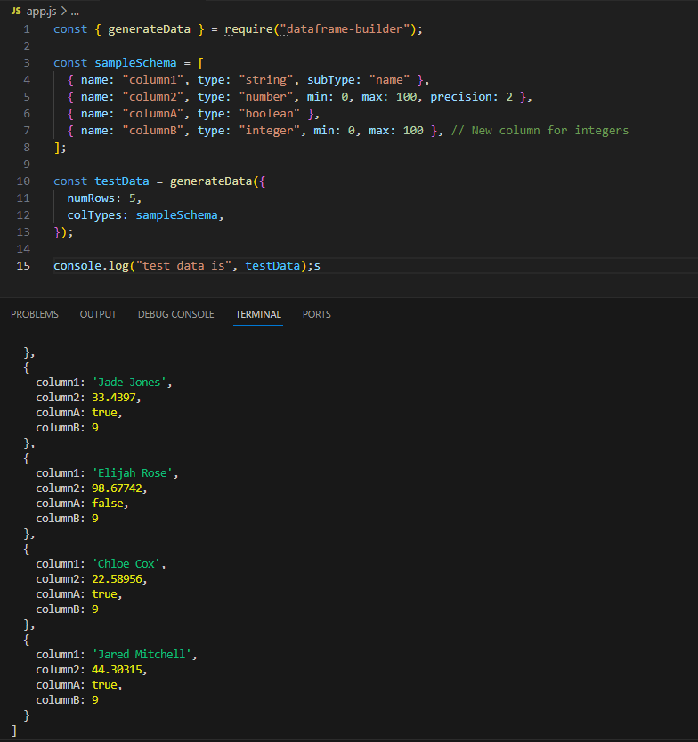

# ui-test-dataframe-builder

This library builds dataframes that can be used to help build UI components.
Suitable to create data for:

- charts
- tables
- UIs

## Features

- ability to specify column types

## Usage

```
const sampleColTypes = [
 { name: "column1", type: "string", subType: "name" },
 { name: "column2", type: "number", min: 0, max: 100, precision: 2 },
 { name: "columnA", type: "boolean" },
 { name: "columnB", type: "integer", min: 0, max: 100 }, // New column for integers
];
```

`console.log("testData", testData);`

Result:

```
testData [
  {
    column1: 'Amelia Lewis',
    column2: 52.6683,
    columnA: true,
    columnB: 52
  },
  {
    column1: 'Jane Clarke',
    column2: 1.24444,
    columnA: false,
    columnB: 53
  },
  {
    column1: 'Mohammed Khan',
    column2: 5.84364,
    columnA: true,
    columnB: 60
  },
  {
    column1: 'Ava Garden',
    column2: 51.95044,
    columnA: true,
    columnB: 47
  },
  {
    column1: 'Jacob Jackson',
    column2: 30.15283,
    columnA: true,
    columnB: 52
  }
]
```

### Screenshot of sample usage


